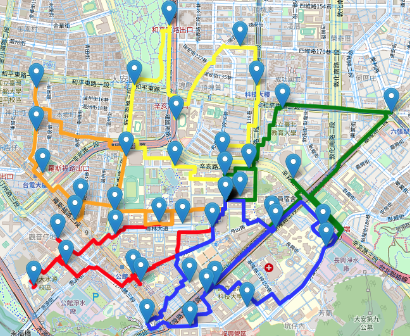
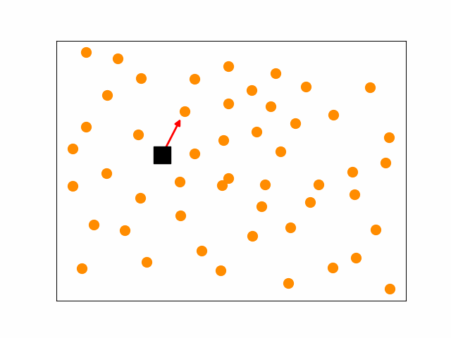
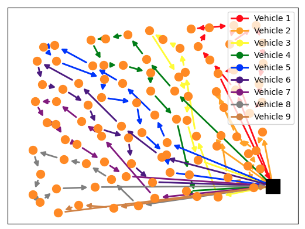

This repo organizes my Master's thesis titled "Deep Reinforcement Learning for Multi-Vehicle Route: An Adaptable Framework by State Encoding and Sequential Construction." It is prepared for the purpose of submission and related matters.

## Abstract 
This study proposes a deep reinforcement learning-based model for multi-vehicle
route planning. By independently and comprehensively modeling the path construction
as a Markov process, the model can capture real-time dynamic changes and uncertain-
ties in practical applications to adjust the planning results. On the other hand, this study
innovatively uses a concatenation scheme to sequentially construct routes for multiple
vehicles, along with a masking mechanism, making the framework easily adaptable to
various logistics applications. An improved Reinforce with Baseline algorithm is intro-
duced for model training and inference. Experimental evaluations are conducted on three
different routing applications: Multiple Traveling Salesman Problem (MTSP), Heteroge-
neous Vehicle Routing Problem (HVRP), and Dynamic Demand &Stochastic traffic time
Vehicle Routing Problem (DSVRP).In the MTSP case using the mTSPlib public dataset,
the proposed model achieves a performance gap of 5.5% compared to Google’s OR-Tools
route optimization algorithm. It accomplishes this with an average computation time of
0.48 seconds, whereas OR-Tools achieves a performance gap of 4.579% with an average
computation time of 4.84 seconds.In the HVRP case, using the Golden-Taillard dataset,
the proposed model outperforms OR-Tools in terms of efficiency, with a performance
gap of 12.57% / 0.642 seconds and 9.87% / 2.334 seconds compared to the best result of
OR-Tools at 9.56% / 10.005 seconds. Lastly, in the DSVRP simulation environment, the
proposed model demonstrates a preference for cost-reducing route decisions. Compared
to the benchmark algorithm, it achieves a 14.7% reduction in transportation costs while
incurring a 9.3% loss in demand fulfill rate.

### Vehicle Routing Problem 

###  MTSP(Multi Traveling Salesman Problem)

