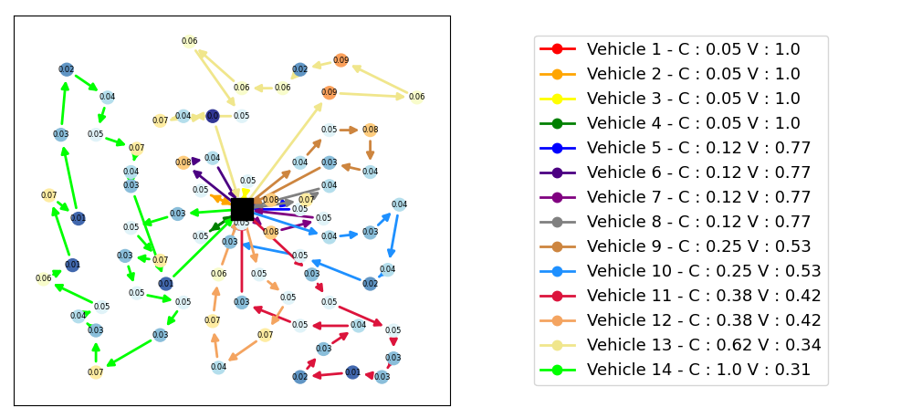
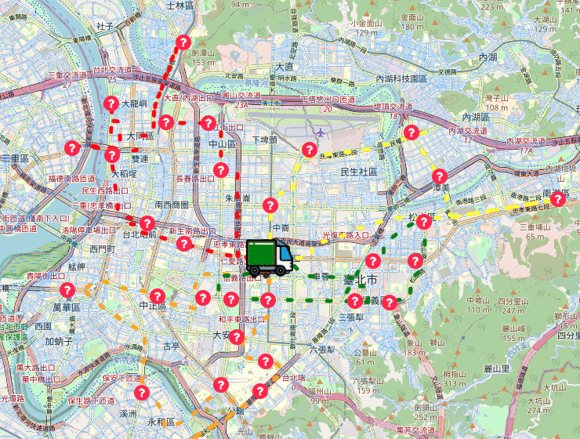

This repo organizes my Master's thesis titled "Deep Reinforcement Learning for Multi-Vehicle Route: An Adaptable Framework by State Encoding and Sequential Construction." It is prepared for the purpose of submission and related matters.

## Abstract 
This study proposes a deep reinforcement learning-based model for multi-vehicle
route planning. By independently and comprehensively modeling the path construction
as a Markov process, the model can capture real-time dynamic changes and uncertain-
ties in practical applications to adjust the planning results. On the other hand, this study
innovatively uses a concatenation scheme to sequentially construct routes for multiple
vehicles, along with a masking mechanism, making the framework easily adaptable to
various logistics applications. An improved Reinforce with Baseline algorithm is intro-
duced for model training and inference. Experimental evaluations are conducted on three
different routing applications: Multiple Traveling Salesman Problem (MTSP), Heteroge-
neous Vehicle Routing Problem (HVRP), and Dynamic Demand &Stochastic traffic time
Vehicle Routing Problem (DSVRP).In the MTSP case using the mTSPlib public dataset,
the proposed model achieves a performance gap of 5.5% compared to Google’s OR-Tools
route optimization algorithm. It accomplishes this with an average computation time of
0.48 seconds, whereas OR-Tools achieves a performance gap of 4.579% with an average
computation time of 4.84 seconds.In the HVRP case, using the Golden-Taillard dataset,
the proposed model outperforms OR-Tools in terms of efficiency, with a performance
gap of 12.57% / 0.642 seconds and 9.87% / 2.334 seconds compared to the best result of
OR-Tools at 9.56% / 10.005 seconds. Lastly, in the DSVRP simulation environment, the
proposed model demonstrates a preference for cost-reducing route decisions. Compared
to the benchmark algorithm, it achieves a 14.7% reduction in transportation costs while
incurring a 9.3% loss in demand fulfill rate.

### Vehicle Routing Problem 

The Vehicle Routing Problem (VRP) refers to the optimization challenge of organizing fleet routes efficiently given specific customer nodes and their demands. The aim is to fulfill customer requirements while satisfying optimization criteria such as task timing, minimizing energy consumption, and other relevant metrics.

###  Multi Traveling Salesman Problem ( MTSP )

The Multi Traveling Salesman Problem  focuses solely on the positions of customer nodes and depot nodes in logistics, without considering customer demands and vehicle characteristics. It is one of the most common types in both machine learning and non-machine learning researchs, serving as a benchmark for testing the effectiveness of frameworks in this paper. We adopt the Min-Max criterion for optimization, which involves minimizing the highest cost among all vehicles to achieve load balancing.

### Heterogenous Vehicle Routing Problem (HVRP) 

The Heterogeneous Vehicle Routing Problem (HVRP), based on the MTSP, incorporates varying demands at customer nodes along with assigning different characteristics to vehicles such as their carrying capacities and velocitys. It also allows vehicles to skip service nodes under specific circumstances. The complexity of route planning significantly increases due to considering both node demands and vehicle characteristics, as evident in the planned results on the validation set illustrated below.

### Dynamic Stochastic Vehicle Routing Problem ( DSVRP ) 

The Dynamic Stochastic Vehicle Routing Problem (DSVRP) involves introducing randomness and dynamic demand variations at nodes as vehicles execute tasks. Additionally, the traffic times between nodes transition from fixed values to reference values with some degree of randomness. This scenario setting is for path planning applications that are closer to reality. The figure below illustrates the dynamic and stochastic vehicles routing experiments conducted in the paper, utilizing OSMnx to obtain a node map of Taipei City. Selected locations within the city were used for experimentation.

